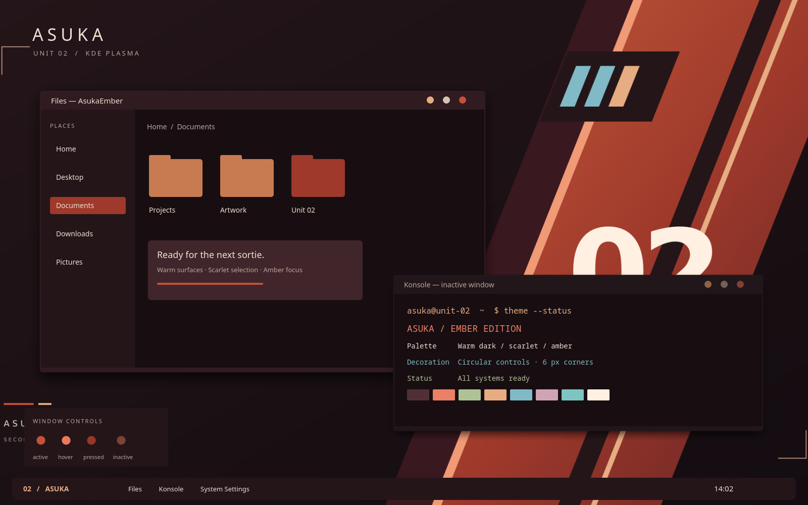

# Asuka Ember — 明日香 · 余烬

以当前 Asuka 为基础、按用户提供的明日香图片配色新建的独立主题。深酒红来自背景建筑与阴影，铜橙来自头发，朱橙来自战斗服，青蓝来自天空与服装细节。文字和交互颜色经过提亮，以适应日常使用。



预览使用真实 KDE KSvg 窗口装饰，应用内容为示例布局。保持现有 Nothing 派生圆角、完整顶栏、阴影遮罩、按钮位置及无图标纯色圆点；使用独立的 `AsukaEmberRounded` 装饰标识，隔离旧缓存。

| 用途 | 配色 |
| --- | --- |
| 内容背景 | `#180E11` |
| 窗口 / 顶栏 | `#241519` / `#301B20` |
| 卡片 / 按钮 | `#40262A` |
| 朱橙强调 / 选中 | `#C65036` / `#9E392B` |
| 铜橙 / 暖浅橙 | `#C87B50` / `#E6AC82` |
| 青蓝链接 | `#80BAC6` |
| 正文 / 次要文字 | `#EEDFD3` / `#BDA49C` |

包括 KDE 配色、Aurorae 装饰、Plasma 风格、全局主题、Konsole 及配套几何壁纸（1080p/1440p/4K）。参考图片只用于取色，包内壁纸为原主题几何图案的新配色。

## 安装

在项目目录，或解压 `dist/AsukaEmber-KDE-Theme.tar.gz` 后进入其中目录执行：

```bash
bash install.sh AsukaEmber
plasma-apply-lookandfeel -a com.omen.asukaember
```

安装只添加文件；第二条命令会切换全局主题。系统设置中的名称为 **AsukaEmber / 明日香 · 余烬**。Konsole 需在配置文件外观中单独选择 AsukaEmber。原 Asuka 和 OMEN 保留。

卸载前切换至其他主题，然后执行 `bash uninstall.sh AsukaEmber`。

## 重建与检查（项目源码目录）

```bash
python3 scripts/build-ember.py
ASUKA_VARIANT=AsukaEmber python3 scripts/render-preview.py
python3 scripts/check-ember.py
python3 scripts/package-ember.py
```

构建依赖与原主题相同。检查配色对比度、阴影尺寸和外框几何是否保持一致、KDE 元数据识别、重复安装与独立卸载。已做 Qt 离屏渲染；本配色版本未自动切换到运行中的桌面。

窗口外框派生自 jomada 的 Nothing 1.2，GPL-3.0；详见 [THIRD_PARTY.md](THIRD_PARTY.md)。

面板、浮动面板、弹窗和提示框已采用 Nothing 的圆角背景及遮罩并按本主题重新着色。Fcitx5 使用 Plasma 皮肤时，候选框圆角由系统 Plasma 风格的弹窗背景生成；更新资源后可运行 `fcitx5-plasma-theme-generator`（不传 `-t`，使用当前系统主题）和 `fcitx5-remote -r` 刷新。
