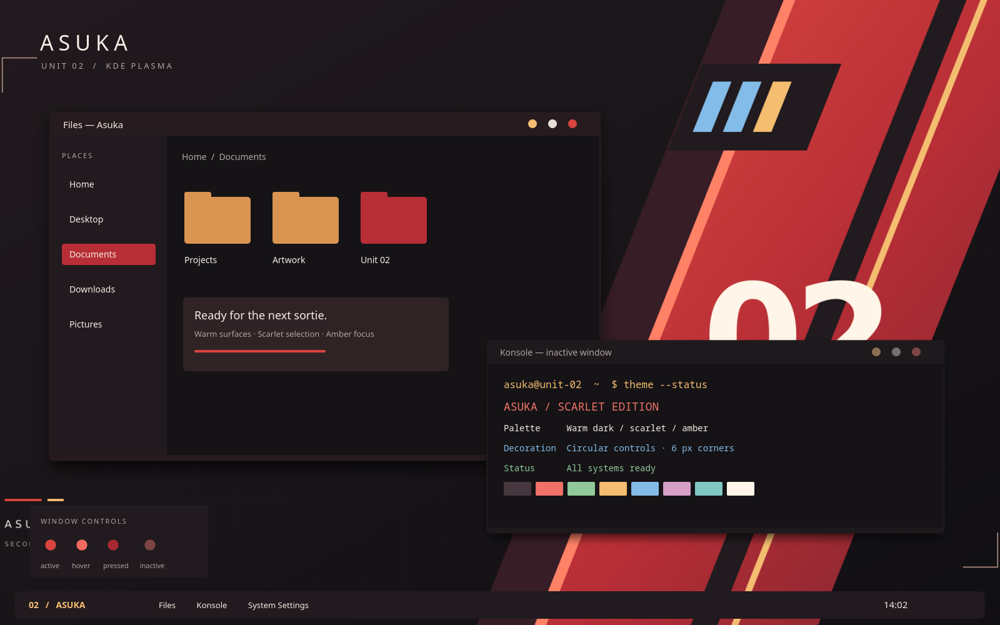

# Asuka KDE Themes

两套明日香配色的 KDE Plasma 主题，包含配色方案、Aurorae 窗口装饰、Plasma 面板和弹窗、Konsole 配色以及配套几何壁纸。

| 主题 | 风格 | 安装 | 应用 |
| --- | --- | --- | --- |
| **Asuka / 明日香·二号机** | 暖黑、朱红、橙金 | `bash install.sh Asuka` | `plasma-apply-lookandfeel -a com.omen.asuka` |
| **Asuka Ember / 明日香·余烬** | 深酒红、铜橙、青蓝 | `bash install.sh AsukaEmber` | `plasma-apply-lookandfeel -a com.omen.asukaember` |

两套主题均使用小圆角窗口、柔和阴影、无图标纯色圆点按钮，以及圆角面板与弹窗。可以并存；安装脚本只安装文件，应用命令才会切换桌面。

完整安装包在 [dist/](dist/)，余烬版说明见 [README-EMBER.md](README-EMBER.md)。




上图为 Qt / KDE KSvg 渲染实际窗口装饰、按钮、面板资源的组合预览。文件管理器和终端内部是示例布局，并非运行中的 Dolphin / Konsole 截图，也不包含图标主题。壁纸采用原创的二号机装甲几何图形，没有角色立绘。

## 安装与应用

在本目录执行，或解压 `dist/Asuka-KDE-Theme.tar.gz` 后进入其中的目录执行：

```bash
bash install.sh
plasma-apply-lookandfeel -a com.omen.asuka
```

安装脚本默认安装 Asuka 到 `${XDG_DATA_HOME:-$HOME/.local/share}`，只复制主题文件，不自动切换桌面。执行第二条命令才会应用全局主题。也可以在系统设置 → 颜色和主题中选择 **Asuka / 明日香 · 二号机**。全局主题统一应用颜色、Breeze 应用程序风格、Plasma 风格、Aurorae 窗口装饰和壁纸；图标、光标、字体、面板布局保留现有设置。

Konsole 需要在「设置 → 编辑当前配置文件 → 外观」中单独选择 **Asuka**。如果桌面没有随全局主题更新壁纸，可在桌面壁纸设置中选择 **Asuka**，或执行：

```bash
plasma-apply-wallpaperimage "${XDG_DATA_HOME:-$HOME/.local/share}/wallpapers/Asuka/contents/images/3840x2160.png"
```

如果组件列表未刷新，可重新打开系统设置，或执行 `kbuildsycoca6 --noincremental`。

## 覆盖范围

| 组件 | 文件 | 改动 |
| --- | --- | --- |
| KDE 配色 | `color-schemes/Asuka.colors` | 暖黑背景、暗红选中、高对比度文字、蓝色链接 |
| Aurorae 窗口装饰 | `aurorae/AsukaRounded/` | 明日香标题栏、Nothing 原版圆角阴影、14px 纯色圆点（26px 点击区域） |
| 装饰状态 | 同上 | 活动/非活动、最大化，以及按钮悬停、按下、禁用；补齐 shade 与 appmenu 图形 |
| Plasma 风格 | `plasma/desktoptheme/Asuka/` | 面板、提示框、弹窗；有效的九宫格边角，其余部件回落 Breeze |
| 全局主题 | `plasma/look-and-feel/com.omen.asuka/` | 统一入口、主题预览 |
| Konsole | `konsole/Asuka.colorscheme` | 不透明背景，保留 ANSI 红绿黄蓝等语义 |
| 壁纸 | `wallpapers/Asuka/contents/images/` | 1080p、1440p、4K；矢量源为 `wallpapers/Asuka-source.svg` |

标题栏按钮的位置最终遵循 KWin 的用户设置；主题提供按钮图形及默认值。应用自己绘制的标题栏可能不会采用 Aurorae 装饰。

## 圆形按钮与小圆角

仅右上角最小化、最大化/还原、关闭按钮借鉴 Nothing 的圆形外观，三个按钮均为无图标、无描边的纯色圆点：最小化为橙金色，最大化/还原为米白色，关闭为朱红色。悬停提亮、按下加深，非活动时降低饱和度与亮度。标题栏保留明日香暖黑配色，外框基于本机 Nothing 1.2（jomada）的完整小圆角、径向角部阴影与遮罩重新着色，移除顶部红线；阴影留白与原始几何严格配套；最大化时保持直角贴边。辅助按钮保持圆角矩形，标题使用系统字体。

## 配色

| 用途 | 色值 |
| --- | --- |
| 窗口背景 / 内容背景 | `#211A1E` / `#151316` |
| Aurorae 标题栏 / 卡片 | `#261B1F` / `#302326` |
| 朱红强调 / 深红选中 | `#D9443F` / `#B82E36` |
| 橙金焦点 / 悬停 | `#F4BD70` / `#FF8267` |
| 正文 / 次要文字 | `#F5EDE4` / `#B3A2A2` |
| 蓝色链接 / 成功 | `#83BCE8` / `#91C99A` |

## 安装包

优先使用 `dist/Asuka-KDE-Theme.tar.gz`，其中包含所有组件和安装脚本。单独安装全局主题 ZIP 不会自动安装配色、装饰和壁纸依赖。

- `dist/Asuka.colors`：系统设置的颜色页面可直接导入，**不要导入 tar.gz**。
- `dist/Asuka-GlobalTheme.zip`：全局主题包。
- `dist/Asuka-Aurorae.zip`：窗口装饰包。
- `dist/Asuka-PlasmaStyle.zip`：Plasma 风格包。
- `dist/Asuka-Wallpaper.zip`：解压后复制 Asuka 目录到用户的 `wallpapers/`，或在壁纸设置中添加里面的 PNG，**不要把 ZIP 当成图片打开**。

## 卸载与原版

先切换到其他主题，再卸载：

```bash
bash uninstall.sh Asuka
```

只移除 Asuka 文件，不会恢复此前的外观设置，也不影响原 OMEN 版本。

安装原版：`bash install.sh OmenDark`；卸载原版：`bash uninstall.sh OmenDark`。原版设计说明见 [README-OMEN.md](README-OMEN.md)，当前脚本参数和安装包操作以本文为准。

## 构建与验证

生成资源需要 Python 3 和 `rsvg-convert`；预览还需要 PySide6、Pillow，以及 KDE 的 `org.kde.ksvg` QML 模块。安装成品不需要这些构建依赖。

```bash
python3 scripts/build-asuka.py
python3 scripts/render-preview.py
python3 scripts/check-asuka.py
python3 scripts/package-asuka.py
```

本机 Plasma 6 的 KPackage 元数据识别、KSvg 离屏渲染、SVG 状态结构、重复安装、带空格路径、卸载隔离检查通过。检查的正文、次要文字、链接和成功/警告/错误文字在正常及交替背景上的最低对比度为 5.59:1。不包含禁用控件和终端 ANSI 黑色。已在本机 KWin 会话验证普通窗口顶栏完整覆盖，尚未穷尽所有缩放比例和窗口状态；保留旧版 Aurorae desktop 元数据，但未在 Plasma 5 上实测。

实现参考 [KDE Aurorae 文档](https://develop.kde.org/docs/plasma/aurorae/) 和 [Plasma 背景 SVG 格式](https://develop.kde.org/docs/plasma/theme/background-svg/)。主题配置沿用 GPL v3；Nothing 派生的窗口外框 SVG 为 GPL-3.0，署名和原始素材见 [THIRD_PARTY.md](THIRD_PARTY.md)。其他原有 SVG 部件沿用项目的 LGPL 说明。此为非官方角色配色主题。

窗口装饰使用独立标识 `AsukaRounded`（显示名称仍为 Asuka），避免旧版 `Asuka` 的 SVG 切片缓存造成顶栏右侧背景缺失。全局主题和安装脚本已同步更新此引用。

面板、浮动面板、弹窗和提示框已采用 Nothing 的圆角背景及遮罩并按本主题重新着色。Fcitx5 使用 Plasma 皮肤时，候选框圆角由系统 Plasma 风格的弹窗背景生成；更新资源后可运行 `fcitx5-plasma-theme-generator`（不传 `-t`，使用当前系统主题）和 `fcitx5-remote -r` 刷新。

## 开源与构建来源

本仓库新增代码及主题配置采用 GPL-3.0，完整许可证见 [LICENSE](LICENSE)。第三方资源保留各自许可证，来源与修改说明见 [THIRD_PARTY.md](THIRD_PARTY.md)。OMEN 原始资源作为构建依赖保留，发布的两个主题为 Asuka 和 Asuka Ember。角色名称仅用于说明灵感来源，此项目为非官方主题。
